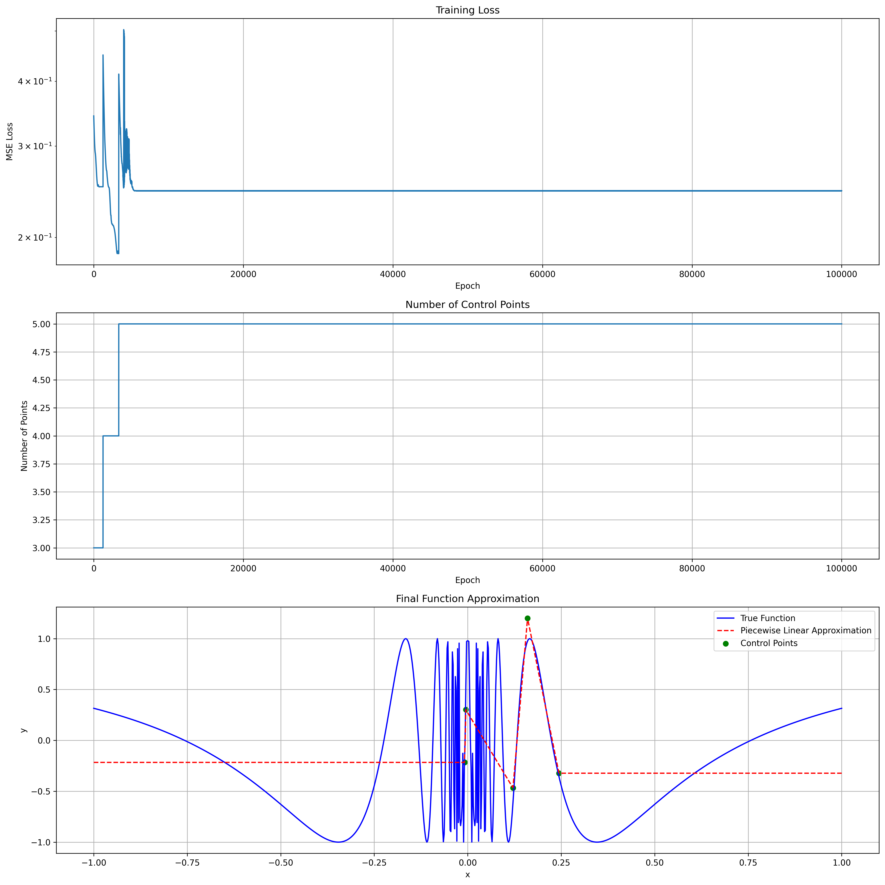

# Non-Uniform Piecewise Linear Layers



A PyTorch implementation of non-uniform piecewise linear layers. These layers can learn arbitrary continuous piecewise linear functions, where both the positions (x-coordinates) and values (y-coordinates) of the control points are learned parameters.

## Installation

```bash
pip install non-uniform-piecewise-layers
```

Or install from source:

```bash
git clone https://github.com/jloveric/non-uniform-piecewise-layers.git
cd non-uniform-piecewise-layers
pip install -e .
```

## Usage

### Basic Example

```python
import torch
from non_uniform_piecewise_layers import NonUniformPiecewiseLinear

# Create a layer with 2 inputs, 3 outputs, and 10 control points per function
layer = NonUniformPiecewiseLinear(
    num_inputs=2,
    num_outputs=3,
    num_points=10
)

# Forward pass
batch_size = 32
x = torch.randn(batch_size, 2)  # Input tensor
y = layer(x)  # Output shape: (batch_size, 3)

# Enforce monotonicity of control points (optional)
layer.enforce_monotonic()
```

### Function Approximation Example

See `examples/sine_fitting.py` for a complete example of approximating a complex function using the non-uniform piecewise linear layer. The example includes:

- Training setup with PyTorch
- Loss function and optimization
- Visualization of results
- Control point position monitoring

## Layer Architecture

The layer consists of the following learnable parameters:

- `positions`: Control point x-coordinates with shape (num_inputs, num_outputs, num_points)
- `values`: Control point y-coordinates with shape (num_inputs, num_outputs, num_points)

For each input-output pair, the layer learns a separate piecewise linear function defined by `num_points` control points. The forward pass performs efficient linear interpolation between these points.

## Square Wave
Non default example
```
python examples/dynamic_square_wave.py training.adapt=move model.num_points=20 training.refine_every_n_epochs=10 data.num_points=100
```

## MNIST
Running with and moving nodes with varrying number of points. You can run with larger learning_rate, to get faster results
```
python examples/mnist_classification.py -m model_type=adaptive epochs=100 move_nodes=True,False num_points=10 learning_rate=1e-4
```

## Shakespeare
Approaching good results with things like this
```
python examples/shakespeare_generation.py -m training.learning_rate=1e-3 training.num_epochs=20 training.move_every_n_batches=200 model.hidden_size=32,64 model.num_points=32 training.batch_size=128
```
small memory machine
```
python examples/shakespeare_generation.py -m training.learning_rate=1e-3 training.num_epochs=20 training.move_every_n_batches=50 model.hidden_size=16 model.num_points=32 training.batch_size=64 training.adapt=move
```

## 3D Implicit Representation
This one is pretty solid
```
python examples/implicit_3d.py mesh_resolution=100 learning_rate=1e-5 hidden_layers=[40, 40]
```
rendering after run
```
python examples/implicit_3d.py render_only=true model_path=/path/to/model.pt high_res_resolution=256
```
different output name
```
python examples/implicit_3d.py render_high_res=true render_output_file="my_render.png"
```

## Running visualization tests
use the -v to write data to file
```
pytest tests/test_visualization.py -v
```